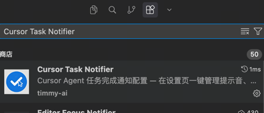
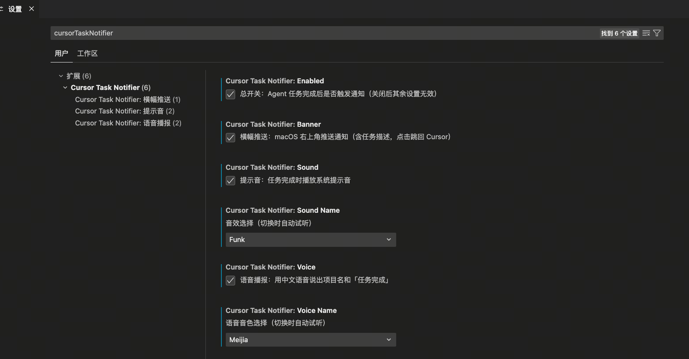

# Cursor Agent 任务完成通知系统

## 背景

在日常开发中，经常会遇到以下场景：

- 同时开启多个 Cursor 窗口跑多个 Agent 任务
- 任务耗时较长（如批量重构、代码分析），期间切到其他工作
- 任务已完成，但因为没有通知而迟迟没有去查看结果，白白浪费时间

本系统基于 **Cursor Hook 机制**，在 Agent 任务完成时自动触发通知。

**功能清单：**

| 功能 | 说明 |
|---|---|
| 📬 横幅推送 | macOS 右上角通知，含任务描述 |
| 🔔 提示音 | 14 种系统音效可选，切换即试听 |
| 🗣 语音播报 | 7 种中文音色可选，切换即试听 |
| 🔇 前台静默 | Cursor 在前台时不打扰 |
| 🔁 去重保护 | 同一任务 60 秒内只通知一次 |
| ⚙️ UI 配置 | Cursor 设置页一键管理，无需编辑文件 |
| 📝 本地日志 | 错过通知也能回溯 |

**核心策略**：Cursor 在前台时静默，不在前台时才通知，不打扰正常操作。
---

## 安装说明

### 一键安装

```
curosr 应用市场搜索 Cursor Task Notifier
```



安装完成后需手动完成两步：

1. **重启 Cursor**
2. **开通通知权限**：系统设置 → 通知 → `terminal-notifier` → 改为「横幅」或「提醒」

---

## 使用说明

### 通知触发条件

| 场景 | 是否通知 |
|---|---|
| Cursor 在前台（你正在操作） | 🔇 静默，不打扰 |
| Cursor 不在前台（切到其他应用） | 🔔 触发完整通知 |

> **说明**：「前台」是 macOS 系统级概念，即当前接收键盘输入的应用。多显示器场景同样适用——Cursor 开在副屏，主屏操作浏览器，视为「不在前台」，会正常通知。

### 通知内容示例

右上角推送：

```plaintext
┌─────────────────────────────────────────┐
│ ✅ xxx · 任务完成                     │
│                        [点击跳回 Cursor] │
└─────────────────────────────────────────┘
```

语音播报：「**xxx 项目任务完成，请查看结果**」

### 在 Cursor 设置页配置

安装完成后，在 Cursor 设置页搜索 `cursorTaskNotifier`，即可通过 UI 开关管理所有配置，**无需手动编辑文件**。


配置分为 4 个分组，从上到下依次为：

| 分组 | 配置项 | 说明 |
|---|---|---|
| **Cursor Task Notifier** | Enabled | 总开关，关闭后其余设置无效 |
| **横幅推送** | Banner | macOS 右上角推送通知 |
| **提示音** | Sound | 提示音开关 |
| | Sound Name | 14 种音效下拉选择，**切换即试听** |
| **语音播报** | Voice | 语音播报开关 |
| | Voice Name | 7 种中文音色下拉选择，**切换即试听** |

**可选音效（14 种）**：Basso、Blow、Bottle、Frog、Funk、Glass、Hero、Morse、Ping、Pop、Purr、Sosumi、Submarine、Tink

**可选语音音色（7 种）**：

| 音色 | 描述 |
|---|---|
| Meijia（美佳） | 台湾女声，清甜温柔（默认） |
| Tingting（婷婷） | 普通话女声，标准清晰 |
| Sinji（善怡） | 粤语女声，香港口音 |
| Grandma（奶奶） | 普通话女声，亲切温暖 |
| Grandpa（爷爷） | 普通话男声，沉稳厚重 |
| Flo | 普通话女声，活泼明快 |
| Reed | 普通话男声，干净利落 |

## 常见问题

### 收不到右上角推送怎么办？

**检查步骤（按顺序排查）：**

1. **确认 terminal-notifier 通知权限**

   系统设置 → 通知 → `terminal-notifier`

   - 通知样式必须是「**横幅**」或「**提醒**」，不能是「无」
   - 推荐改为「**提醒**」，不会自动消失

2. **确认没有开启勿扰模式 / 专注模式**

   系统设置 → 专注模式 → 确认未开启（菜单栏有月亮 🌙 图标说明已开启）

3. **确认通知是否进了通知中心**

   从屏幕右上角向下滑，查看通知中心积压的通知


### 收不到语音播报怎么办？

```bash
# 确认语音包已安装
say -v "Meijia" "测试"

# 若无法发音，在系统设置里下载中文语音包：
# 系统设置 → 辅助功能 → 朗读内容 → 系统语音 → 管理语音
```

### 多个任务同时完成，通知会叠加吗？

不会。

---

## 系统要求

| 依赖 | 要求 | 说明 |
|---|---|---|
| 操作系统 | macOS 13 Ventura 及以上 | 依赖 `lsappinfo` 前台检测 |
| [Cursor](https://cursor.sh) | 最新版 | 需支持 Hook 机制（2.x+）|
| [Homebrew](https://brew.sh) | 任意版本 | 用于安装 terminal-notifier |
| terminal-notifier | 自动安装 | 负责 macOS 横幅推送 |
| Python3 | 系统自带即可 | 解析 Hook 事件 JSON |
| Xcode Command Line Tools | 可选 | 编译 `raise-cursor`（点击通知跳回 Cursor）|
| 中文语音包 | 可选 | 语音播报功能需在系统设置中下载 |

**安装 Xcode Command Line Tools（如缺失）：**

```bash
xcode-select --install
```